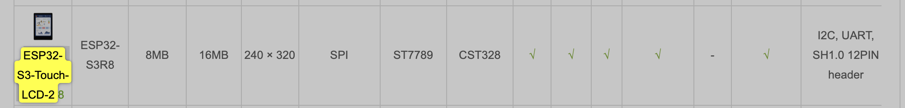
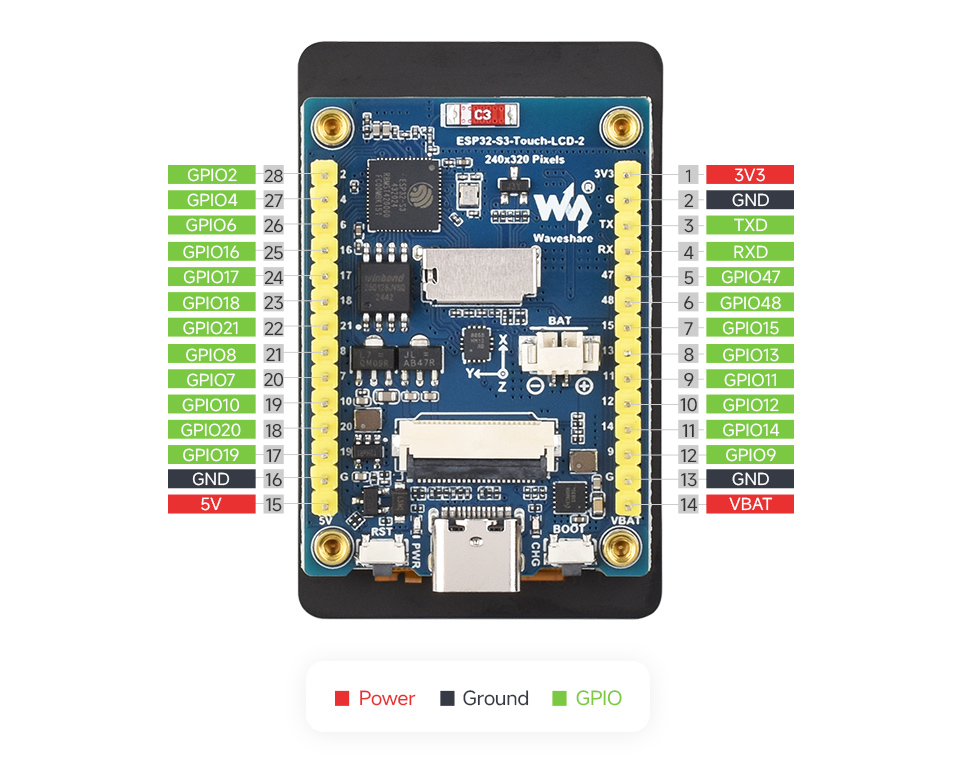
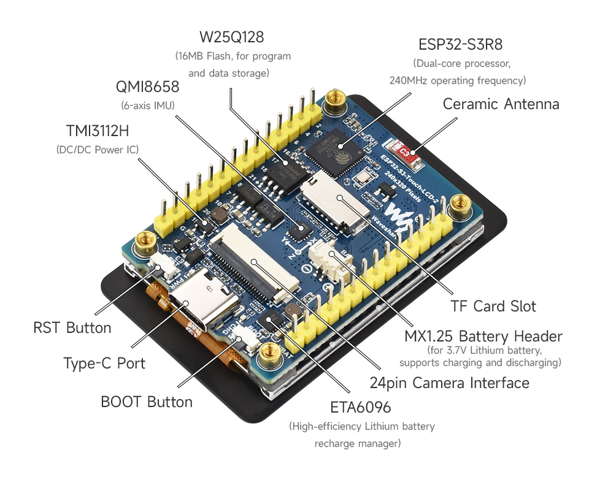
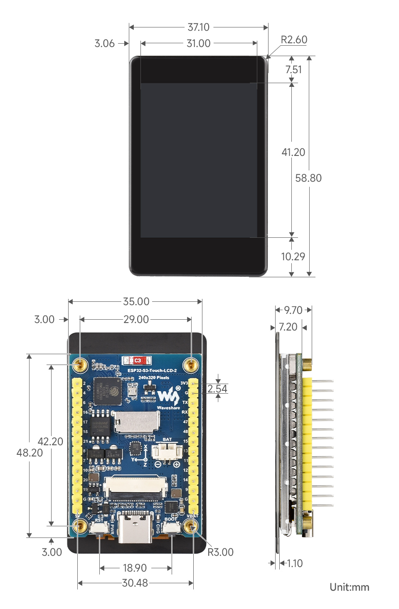

# Waveshare
Embedded with ST7789T3 Display Driver and CST816D Capacitive Touch Chip

https://www.waveshare.com/esp32-s3-touch-lcd-2.htm?srsltid=AfmBOopIKqrXfhDCqgm_LjFEginOuJtt5PfkqyhTU73vWqY1ubmix5Tl

## Keyfeatures
Key features include:

Equipped with ESP32-S3R8 Xtensa 32-bit LX7 dual-core processor, up to 240MHz main frequency
Supports 2.4GHz Wi-Fi (802.11 b/g/n) and Bluetooth 5 (LE), with onboard antenna
Built in 512KB of SRAM and 384KB ROM, with onboard 8MB PSRAM and an external 16MB Flash memory
Type-C connector, improving device compatibility, easier to use
Onboard 2inch capacitive touch display for clear color picture display, 240 × 320 resolution, 262K color
Built-in ST7789T3 display driver and CST816D capacitive touch chip, using SPI and I2C communication respectively, effectively saving the IO resources
Onboard QMI8658 6-axis IMU (3-axis accelerometer and 3-axis gyroscope)
Onboard 3.7V MX1.25 Lithium battery recharge/discharge header
Onboard USB Type-C port for power supply, program downloading, and debugging, more convenient for development use
Onboard TF card slot for external TF card storage of pictures or files
Adapting 22 × GPIO pins for flexible configuration of pin function
Onboard camera interface, compatible with mainstream cameras such as OV2640 and OV5640 for image and video acquisition

## LCD
LCD Parameters
| **Type**             | Info             | **Type**           | Info               |
| -------------------- | ---------------- | ------------------ | ------------------ |
| **DISPLAY PANEL**    | IPS LCD          | **DISPLAY SIZE**   | 2inch              |
| **RESOLUTION**       | 240 × 320 pixels | **DISPLAY COLORS** | 262k               |
| *DISPALY INTERFACE** | 4-wire SPI       | **DRIVER IC**      | ST7789T3           |
| **TOUCH INTERFACE**  | I2C              | **TOUCH IC**       | CST816D            |
| **TOUCH TYPE**       | Capacitive touch | **TOUCH POINT**    | Single-point touch |

## Waveshare Wiki
https://docs.waveshare.com/ESP32-S3-Touch-LCD-2.8

## Pinout

## Whats on board

## outline dimensioins

# platformio.ini (waveshare)
; PlatformIO Project Configuration File
;
;   Build options: build flags, source filter
;   Upload options: custom upload port, speed and extra flags
;   Library options: dependencies, extra library storages
;   Advanced options: extra scripting
;
; Please visit documentation for the other options and examples
; https://docs.platformio.org/page/projectconf.html

[env:esp32dev]
platform = espressif32
board = esp32-s3-devkitc-1
framework = arduino
monitor_speed = 115200

board_build.arduino.memory_type = dio_opi
board_build.flash_mode          = dio
board_build.psram_type          = opi

board_upload.flash_size          = 16MB
board_build.partitions           = default_16MB.csv
board_build.extra_flags          = -DBOARD_HAS_PSRAM

lib_deps =
  lvgl/lvgl @ 9.4.0
  lovyan03/LovyanGFX @ 1.2.7

build_flags =
  -D ARDUINO_USB_MODE=1
  -D ARDUINO_USB_CDC_ON_BOOT=1
  -D LV_CONF_INCLUDE_SIMPLE
  -I src