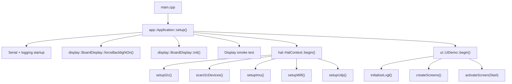
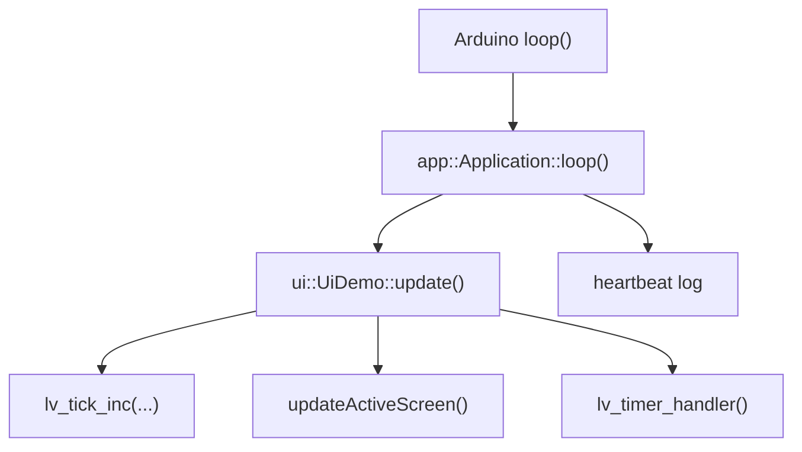
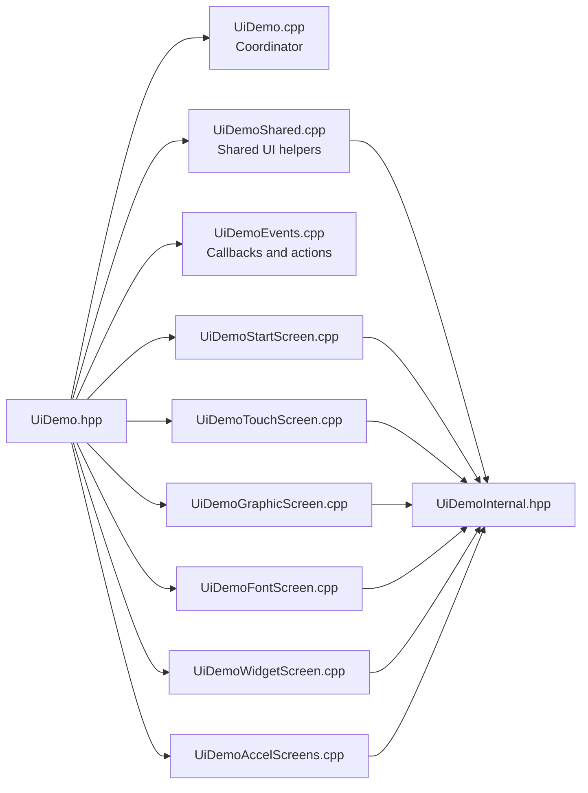
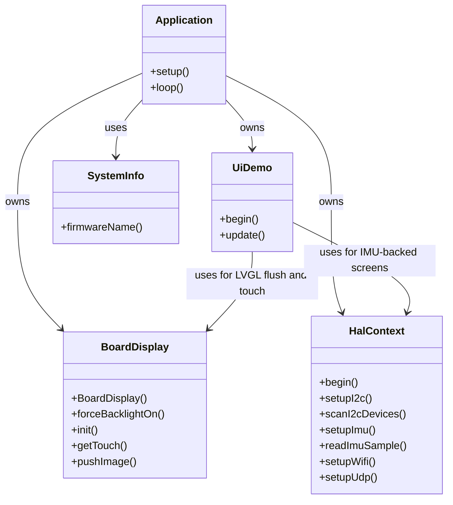
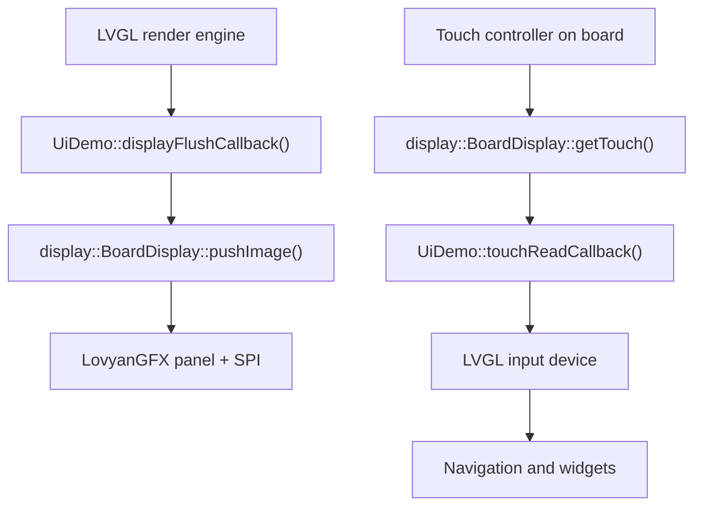
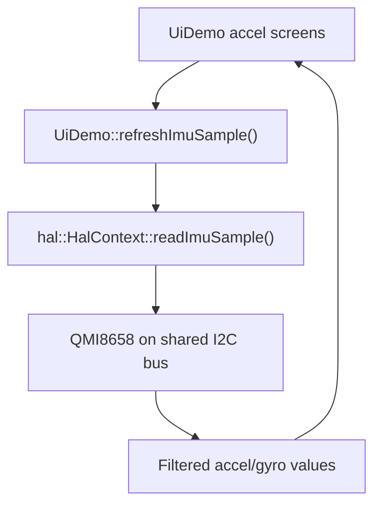

# Project Architecture Overview

## Purpose

This document gives developers a quick orientation map of the project.

It explains:

- which files matter most
- which classes own which responsibilities
- how startup flows through the firmware
- how the display, touch, UI, and HAL layers interact

The goal is not to repeat every implementation detail. The goal is to make it
easy to find the correct file before changing behavior.

## Main Directory Structure

```text
include/
  app/
  display/
  hal/
  modules/
  ui/

src/
  app/
  display/
  hal/
  modules/
  ui/

doc/
  ...
```

## Most Important Files

### Application Entry and Lifecycle

- `src/main.cpp`
- `include/app/Application.hpp`
- `src/app/Application.cpp`

### Board Hardware Access

- `include/display/BoardDisplay.hpp`
- `src/display/BoardDisplay.cpp`
- `include/hal/HalContext.hpp`
- `src/hal/HalContext.cpp`

### UI Root and Screen Implementations

- `include/ui/UiDemo.hpp`
- `src/ui/UiDemo.cpp`
- `src/ui/UiDemoShared.cpp`
- `src/ui/UiDemoEvents.cpp`
- `src/ui/UiDemoStartScreen.cpp`
- `src/ui/UiDemoTouchScreen.cpp`
- `src/ui/UiDemoGraphicScreen.cpp`
- `src/ui/UiDemoFontScreen.cpp`
- `src/ui/UiDemoWidgetScreen.cpp`
- `src/ui/UiDemoAccelScreens.cpp`
- `src/ui/UiDemoInternal.hpp`

### Small Reusable Support Modules

- `include/modules/SystemInfo.hpp`
- `src/modules/SystemInfo.cpp`
- `include/log_core.h`

## High-Level Class Responsibilities

### `app::Application`

Owns the top-level firmware startup and runtime loop.

Responsibilities:

- initialize serial logging
- initialize the display hardware
- run the display smoke test
- initialize HAL services
- start the UI
- keep the Arduino `loop()` thin

### `display::BoardDisplay`

Owns the board-specific LovyanGFX configuration.

Responsibilities:

- configure SPI for the ST7789 panel
- configure panel geometry and controller behavior
- configure PWM backlight
- configure CST816-family touch controller
- expose a LovyanGFX display object to the UI layer

### `hal::HalContext`

Owns non-UI hardware services.

Responsibilities:

- initialize the shared I2C bus
- scan I2C devices
- configure and sample the QMI8658 IMU
- configure Wi-Fi
- configure UDP

### `ui::UiDemo`

Acts as the central UI control hub.

Responsibilities:

- initialize LVGL
- create and register all screens
- route activation between logical screens
- update only the currently active screen logic
- bind LVGL display flush and touch input callbacks

Important design decision:

- `UiDemo` remains the coordinator
- individual screen implementations live in separate source files
- shared UI helpers and event callbacks are centralized and reused

## Startup Flow



## Runtime Loop



## UI File Split

`UiDemo` was intentionally decomposed so that each screen can evolve without
re-growing a single monolithic implementation file.

### Coordinator

- `src/ui/UiDemo.cpp`

Contains:

- LVGL initialization
- screen creation dispatch
- screen activation dispatch
- active-screen update dispatch
- shared IMU refresh entry

### Shared Helpers

- `src/ui/UiDemoShared.cpp`
- `src/ui/UiDemoInternal.hpp`

Contain:

- theme constants
- color helpers
- panel/screen style helpers
- shared title/button/value-row creation
- sprite helper functions
- generic formatting helpers
- FPS smoothing helper

### Event and Callback Layer

- `src/ui/UiDemoEvents.cpp`

Contains:

- LVGL display flush callback
- touch input callback
- touch state logging
- generic navigation callback

### Screen Implementations

- `src/ui/UiDemoStartScreen.cpp`
- `src/ui/UiDemoTouchScreen.cpp`
- `src/ui/UiDemoGraphicScreen.cpp`
- `src/ui/UiDemoFontScreen.cpp`
- `src/ui/UiDemoWidgetScreen.cpp`
- `src/ui/UiDemoAccelScreens.cpp`

Each of these files owns the screen-specific layout and runtime behavior for
its screen group.

## UI Class and File Relationship



## Main Object Relationships



## Display / Touch / UI Interaction



## HAL / Sensor Interaction



## Practical Change Guide

### When you want to change startup behavior

Start here:

- `src/main.cpp`
- `src/app/Application.cpp`

### When you want to change display pins or panel tuning

Start here:

- `src/display/BoardDisplay.cpp`

### When you want to change IMU behavior, filtering, Wi-Fi, or UDP

Start here:

- `src/hal/HalContext.cpp`

### When you want to add or modify a screen

Start here:

- `include/ui/UiDemo.hpp`
- the matching `src/ui/UiDemo*Screen.cpp` file

### When you want to change common navigation or callbacks

Start here:

- `src/ui/UiDemoShared.cpp`
- `src/ui/UiDemoEvents.cpp`

## Recommended Mental Model

Use this simplified mental model while navigating the project:

- `Application` starts everything
- `BoardDisplay` knows the board wiring
- `HalContext` knows non-UI peripherals
- `UiDemo` coordinates the UI
- screen-specific `.cpp` files own their layouts and update logic
- shared callbacks and shared UI components live outside the screen files

That separation should be preserved as the project grows. It keeps the codebase
readable and prevents the UI root from turning back into a monolith.
